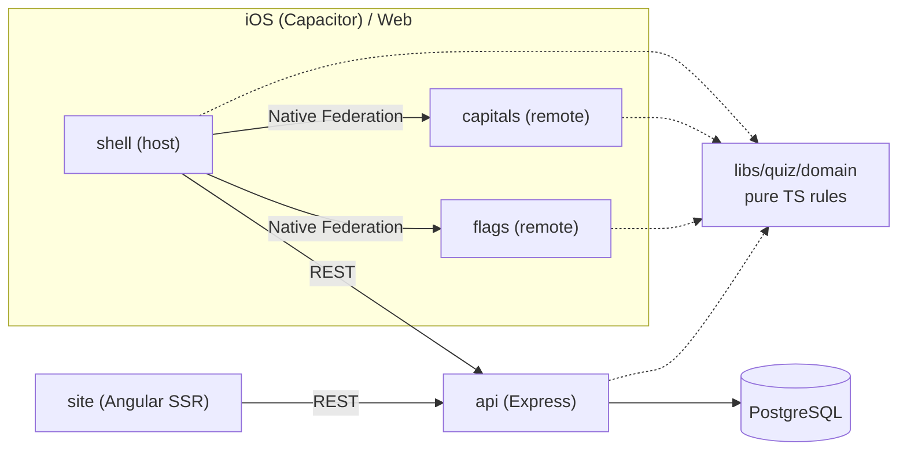

# World Quiz

A mobile-first learning app for memorising **world capitals** and **flags**,
built as a full-stack portfolio project on a modern Angular ecosystem: **Nx,
Angular 22 (signals, zoneless), Native Federation microfrontends, Ionic,
Capacitor (iOS), Express 5, PostgreSQL** and a multi-level test strategy.

> **Project status: Phase 3, shell and design system.** The workspace, CI,
> the 195-country dataset and the platform-independent quiz domain are in
> place, together with the Ionic shell: tab navigation, Home, Achievements,
> Leaderboard (with an honest "not available yet" state), Settings, a light and
> dark design system with Liquid Glass accents, and English/Russian UI. Quizzes
> are not playable yet; they arrive with the Capitals/Flags microfrontends.
> This README only describes what exists; planned items are marked as such.

## Product in one minute

- **Capitals** (country → capital) and **Flags** (flag → country), for 195 countries.
- **Easy:** choose from four options. **Hard:** type the answer or dictate it with the iOS keyboard. Answers are matched locally, typo-tolerant, in English and Russian.
- **Training modes:** Fixed, Endless, Timed (60 s), Practice Mistakes, by region or worldwide.
- **Mastery and achievements** track real learning progress per region.
- **Global leaderboards** are _perfect-run challenges_: answer all 195 correctly, fastest time wins (4 boards).
- **Offline-first:** play and progress work without a network; results sync later without duplicates.
- **Sign in with Apple / Google**, light/dark themes, Liquid Glass-inspired UI.

Screenshots will be added once quizzes are playable. The visual direction
comes from a Figma prototype; its placeholder data is not used.

## Architecture



The same quiz rules run in the browser (offline play) and on the server
(result validation). More: [architecture overview](docs/architecture/overview.md).

## Technology stack

| Area                     | Choice                                                            | Status        |
| ------------------------ | ----------------------------------------------------------------- | ------------- |
| Monorepo                 | Nx 23 (integrated, tag-enforced boundaries)                       | ✅            |
| Frontend                 | Angular 22 (standalone, zoneless, signals), esbuild               | ✅ skeleton   |
| Microfrontends           | Native Federation 22                                              | 📐 Phase 4    |
| Mobile UI                | Ionic 9 (iOS mode), design tokens, Liquid Glass                   | ✅            |
| i18n                     | Transloco, English + Russian, `Intl.PluralRules`                  | ✅            |
| State                    | Angular signal stores (no NgRx)                                   | ✅            |
| Native (iOS)             | Capacitor 8 (Preferences plugin in use)                           | 📐 Phase 13   |
| Backend                  | Node 24, Express 5, Zod, esbuild (ESM)                            | ✅ skeleton   |
| Database                 | PostgreSQL + Drizzle ORM                                          | 📐 Phase 6    |
| Auth                     | Sign in with Apple, Google; server-verified tokens                | 📐 Phase 7    |
| Offline                  | IndexedDB (Dexie) + outbox sync                                   | 📐 Phase 8    |
| SSR                      | Separate Angular SSR `site` app                                   | 📐 Phase 9    |
| Quiz domain              | Pure TS engine, seeded questions, typo-tolerant matching, mastery | ✅            |
| Country data             | 195 countries (en/ru), UN M49 regions, `flag-icons` SVGs          | ✅            |
| Unit/component/API tests | Vitest 4, Angular TestBed, supertest, PGlite                      | ✅ foundation |
| E2E                      | Cypress 15                                                        | ✅ smoke test |
| CI                       | GitHub Actions + `nx affected`                                    | ✅            |

✅ implemented · 📐 designed and approved, not implemented yet

## Repository layout

```
apps/
  shell/       Angular host application
  capitals/    Angular app, future Capitals remote
  flags/       Angular app, future Flags remote
  api/         Express API
  shell-e2e/   Cypress tests
libs/
  quiz/domain/    Pure TypeScript quiz rules (no Angular, DOM or Node)
  quiz/countries/ 195-country dataset (English/Russian) and flag paths
  client/ui/       Design system: tokens, themes, glass, UI components
  client/i18n/     Transloco setup and English/Russian translations
  client/settings/ Theme and language settings, storage, document sync
  shared/util/ Pure TypeScript helpers
docs/          Architecture, decisions (ADRs), domain rules, testing, deployment
```

## Getting started

Requires **Node 24.15+** (`nvm use`).

```bash
npm ci
npm run start:shell    # http://localhost:4200
npm run start:api      # http://localhost:3333/health
```

| Task                                      | Command          |
| ----------------------------------------- | ---------------- |
| All checks (lint, typecheck, test, build) | `npm run check`  |
| Unit/component/API tests                  | `npm run test`   |
| Cypress E2E                               | `npm run e2e`    |
| Formatting                                | `npm run format` |
| Dependency graph                          | `npm run graph`  |

Details: [setup](docs/development/setup.md) · [environment](docs/development/environment.md) · [troubleshooting](docs/development/troubleshooting.md).

## Documentation

| Topic                            | Document                                                                       |
| -------------------------------- | ------------------------------------------------------------------------------ |
| Architecture overview and phases | [docs/architecture/overview.md](docs/architecture/overview.md)                 |
| Nx workspace and boundaries      | [docs/architecture/nx.md](docs/architecture/nx.md)                             |
| Decisions (ADRs)                 | [docs/decisions](docs/decisions/README.md)                                     |
| Frontend (shell)                 | [docs/architecture/frontend.md](docs/architecture/frontend.md)                 |
| Design system and Liquid Glass   | [docs/architecture/design-system.md](docs/architecture/design-system.md)       |
| Internationalization             | [docs/architecture/i18n.md](docs/architecture/i18n.md)                         |
| State management                 | [docs/architecture/state-management.md](docs/architecture/state-management.md) |
| Country dataset                  | [docs/domain/countries.md](docs/domain/countries.md)                           |
| Quiz engine                      | [docs/domain/quiz-engine.md](docs/domain/quiz-engine.md)                       |
| Hard-mode answer matching        | [docs/domain/answer-matching.md](docs/domain/answer-matching.md)               |
| Scoring                          | [docs/domain/scoring.md](docs/domain/scoring.md)                               |
| Achievements                     | [docs/domain/achievements.md](docs/domain/achievements.md)                     |
| Leaderboard rules                | [docs/domain/leaderboard.md](docs/domain/leaderboard.md)                       |
| Mastery rules                    | [docs/domain/mastery.md](docs/domain/mastery.md)                               |
| Testing strategy                 | [docs/testing/strategy.md](docs/testing/strategy.md)                           |
| CI/CD                            | [docs/deployment/ci-cd.md](docs/deployment/ci-cd.md)                           |

## Learning objectives

This project deliberately exercises technologies that are valuable for a
senior Angular engineer, and records _why_ each was chosen, including the
trade-offs, in ADRs:

- Nx monorepo architecture, project graph, affected builds, enforced boundaries
- Angular signals, zoneless change detection, modern control flow and DI
- Runtime microfrontend composition with Native Federation
- Angular SSR and hydration, and when _not_ to use it
- Ionic + Capacitor iOS delivery (signing, TestFlight, App Store)
- Express + PostgreSQL + ORM, API contracts and validation
- OAuth (Apple/Google) with server-side verification and secure token storage
- Offline-first design and idempotent synchronization
- Unit, component, integration, API and Cypress E2E testing
- GitHub Actions CI/CD

## Development workflow

Work happens on feature branches (`feat/*`), one coherent increment per pull
request. Every PR is reviewed and merged manually; `main` stays green.
