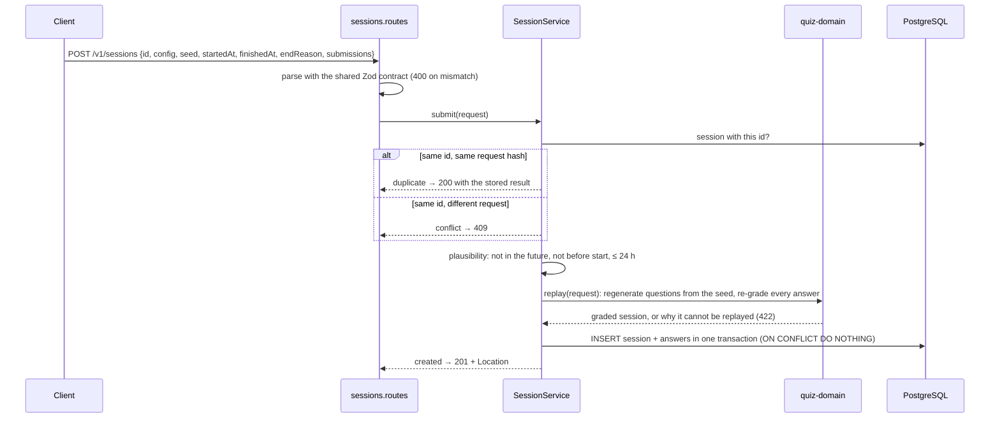
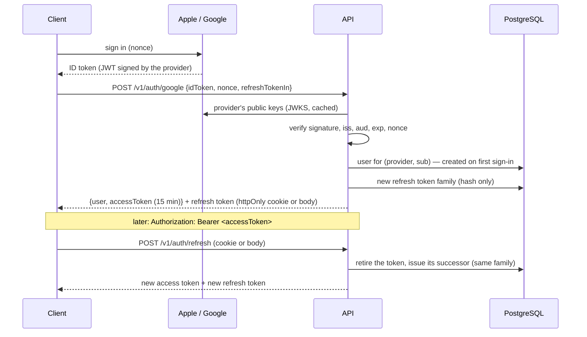
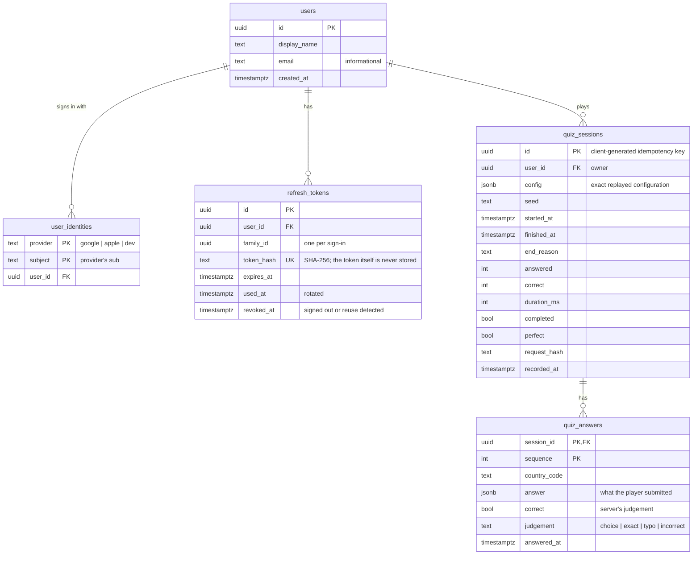

# Backend (API)

> Status: ✅ Phase 6 — Express 5 API, PostgreSQL with Drizzle, migrations,
> finished quiz sessions graded by the server. ✅ Phase 7a — sign-in with
> Google and Apple ID tokens, access/refresh tokens, account deletion; every
> session belongs to a signed-in player.
> 📐 Client sign-in (Phase 7b), progress sync (Phase 8), leaderboards (Phase 9).
> The app does not call the API yet.

Why PostgreSQL, Drizzle and PGlite: [ADR-005](../decisions/ADR-005-database.md).
Why this sign-in design: [ADR-010](../decisions/ADR-010-authentication.md).

## Structure

```
apps/api/
  drizzle.config.ts        drizzle-kit: schema → SQL migrations
  drizzle/                 generated SQL migrations (committed)
  src/
    main.ts                composition root: config → database → migrate → app → listen
    config.ts              environment, validated with Zod at start-up
    app.ts                 Express app factory (no listen), error handling
    http/problem.ts        RFC 9457 problem-details responses
    http/cors.ts           allow-listed origins, with credentials
    http/cookies.ts        the refresh-token cookie
    auth/
      auth.routes.ts       /v1/auth: google, apple, dev, refresh, logout
      me.routes.ts         /v1/me: read, delete the account
      require-auth.ts      Authorization: Bearer → the user id
      auth-service.ts      sign-in, refresh, sign-out, deletion
      identity-verifier.ts provider ID tokens against their JWKS
      access-tokens.ts     15-minute HS256 JWTs
      refresh-tokens.ts    rotation + reuse detection (hashes only)
      user-repository.ts   users and their provider identities
    db/schema.ts           tables (Drizzle)
    db/database.ts         PostgreSQL (pg) or PGlite behind one Database type
    sessions/
      sessions.routes.ts   HTTP: parse, call the service, map outcomes to status codes
      session-service.ts   the rules: plausibility, replay, idempotency
      session-repository.ts  SQL only
      request-hash.ts      canonical JSON + SHA-256
    testing/               test database, test API, fake identity provider, a helper that plays real sessions
libs/shared/contracts/     Zod schemas of requests, responses and errors
```

Layers depend inward: routes → service → repository → database. The service
knows the quiz rules (through `quiz-domain`) but no SQL; the repository knows
SQL but no quiz rules. `createApp()` receives its dependencies, so tests use a
manual clock and an in-memory database.

## Recording a session: `POST /v1/sessions`

The client sends **what the player did** — configuration, seed, timestamps and
the answers given — and never a score, correctness or mastery. The request
schema is strict: unknown fields such as `score` are rejected, not ignored.



- **The server grades.** `replay` rebuilds the exact questions from the seed and
  runs every answer through the same matching rules the client used. A choice
  that was not offered, a text answer in Easy mode, answers after the time ran
  out, or an ending that does not match the answers make the whole session
  **rejected** (422) — the server does not "fix" a session.
- **Idempotency.** `id` is a UUID the client generates once per session,
  normalised to lower case (as PostgreSQL stores it). The server stores a
  SHA-256 of the canonical request as parsed by the contract (keys sorted, so
  key order does not matter). Because the parsed request is hashed, a new
  request field must not get a `.default()`: older clients' retries would hash
  differently and get 409. A retry with the same body returns the stored result
  (200); a different body under the same id is a conflict (409). Two identical
  requests racing each other are resolved by the primary key and
  `ON CONFLICT DO NOTHING`: exactly one inserts.
- **Plausibility.** `finishedAt` may be at most 5 minutes ahead of the server
  clock and at most 24 hours after `startedAt`. These bounds stop obviously
  forged timestamps; precise timing for leaderboards is decided in Phase 9.

`GET /v1/sessions/:id` returns the stored result (404 when unknown, 400 when
the id is not a UUID).

### Honest limits

- **Health is liveness only.** `/health` answers without touching the
  database. A readiness check that also runs `SELECT 1` (what an orchestrator
  needs before sending traffic) comes with deployment in Phase 12.
- Only `/v1/auth` is rate-limited; general request limits come with
  deployment (Phase 12).
- The shell does not send sessions yet (Phase 8 adds the outbox and sync).

## Signing in: `/v1/auth` and `/v1/me`



| Endpoint                         | Does                                                                                           |
| -------------------------------- | ---------------------------------------------------------------------------------------------- |
| `POST /v1/auth/google`, `/apple` | Verifies the provider ID token, signs in (creating the user on first sign-in)                  |
| `POST /v1/auth/dev`              | Development/E2E sign-in with any subject; only with `AUTH_DEV_LOGIN=true`, never in production |
| `POST /v1/auth/refresh`          | Rotates the refresh token (body for native, cookie for web)                                    |
| `POST /v1/auth/logout`           | Revokes the refresh token's family, clears the cookie                                          |
| `GET /v1/me`                     | The signed-in user                                                                             |
| `DELETE /v1/me`                  | Deletes the account with everything it owns                                                    |

- **Refresh tokens rotate with reuse detection.** A token that was already
  exchanged, presented again, revokes its whole family — the thief and the
  user both have to sign in again. Two simultaneous refreshes with the same
  token therefore sign the client out; the client serialises refreshes.
- **Cookie** (`wq_refresh`): `HttpOnly`, `SameSite=Strict`,
  `Path=/v1/auth`, `Secure` in production (`COOKIE_SECURE`). Scripts cannot
  read it, other sites cannot send it, other endpoints never receive it.
- **CORS** allows credentials only for `CORS_ORIGINS` (by default
  `http://localhost:4200` outside production, nothing in production).
- **Sign-in failures are vague** (401 "could not be verified"): which check
  failed helps an attacker more than a client.
- `/v1/sessions` and `/v1/me` require `Authorization: Bearer`. A player reads
  only their own sessions; someone else's session id is a 409 on write and a
  404 on read. After an account is deleted, its still-valid access token gets
  401 when it tries to record a session or read `/v1/me`.

## Errors

Every error is an [RFC 9457](https://www.rfc-editor.org/rfc/rfc9457) problem
document (`application/problem+json`), described by `problemDetailsSchema` in
`shared/contracts`:

| Status | When                                                                                                                                           |
| ------ | ---------------------------------------------------------------------------------------------------------------------------------------------- |
| 400    | Body breaks the contract (with `errors: [{path, message}]`), malformed JSON, malformed id                                                      |
| 401    | Missing, invalid or expired access token (`WWW-Authenticate: Bearer`); unverifiable ID token; invalid or reused refresh token; deleted account |
| 404    | Unknown session or route                                                                                                                       |
| 409    | Session id already used by a different session                                                                                                 |
| 413    | Body larger than 256 kB                                                                                                                        |
| 422    | Well-formed session the server cannot verify; `type` names the reason, e.g. `urn:world-quiz:session-rejected:inconsistent-ending`              |
| 429    | Too many requests to `/v1/auth` from one client                                                                                                |
| 503    | Sign-in with a provider that has no client id configured                                                                                       |
| 500    | Anything unexpected: logged on the server, generic message to the client                                                                       |

## Database



- Category, difficulty, mode and scope are also stored as columns for queries
  (leaderboards, statistics); `config` keeps the exact replay input.
- The database enforces invariants too: `correct <= answered`,
  `duration_ms >= 0`, answers cascade-delete with their session.
- Enumerations are `text`, validated at the API boundary against the domain
  vocabulary. PostgreSQL enums would make adding a mode a migration.

### Migrations

```bash
npx nx run api:db-generate   # after changing src/db/schema.ts
```

drizzle-kit compares the schema with the last snapshot in `drizzle/meta` and
writes a new SQL file. Review it like code and commit it. The API applies
pending migrations when it starts; tests apply all of them to a fresh
in-memory database.

## Tests on PGlite and on PostgreSQL

API tests (`npx nx test api`) use an in-memory PGlite by default — the same
in CI. To run the same suite against a PostgreSQL server:

```bash
TEST_DATABASE_URL=postgres://localhost:5432/world_quiz npx nx test api
```

Each test file then creates its own temporary database on that server
(`world_quiz_test_<random>`), applies the migrations and drops it at the end,
so test files can run in parallel. The user needs the `CREATEDB` privilege
(Homebrew's default user has it). `TEST_DATABASE_URL` is part of the Nx cache
key, so a PostgreSQL run never reuses a PGlite result.

PostgreSQL is where concurrency is real: the test "records two identical
requests that race each other exactly once" exercises the primary key and
`ON CONFLICT DO NOTHING`; on PGlite the same test passes because queries run
one at a time.

## Running

```bash
npm run start:api   # http://localhost:3333 — PGlite in .data/pglite, no setup needed
DATABASE_URL=postgres://localhost:5432/world_quiz npm run start:api   # a PostgreSQL server
```

Variables: [environment.md](../development/environment.md).
