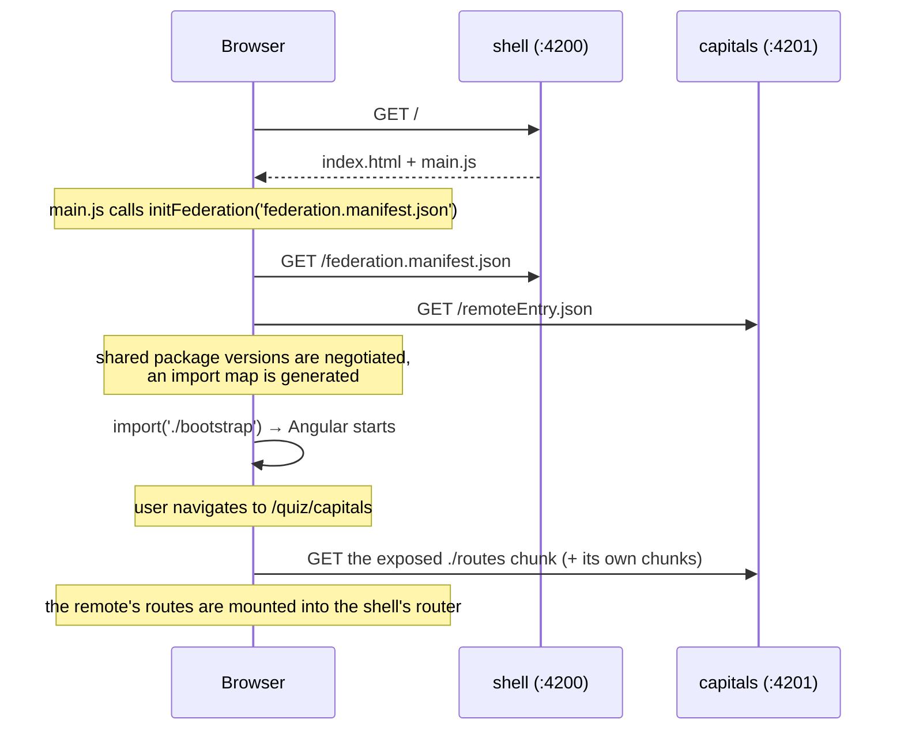

# Microfrontends (Native Federation)

> Status: ✅ Capitals remote (Phase 4) · ✅ Flags remote (Phase 5) ·
> 📐 iOS bundling of the manifest (Phase 13)

Why Native Federation and not classic Module Federation is decided in
[ADR-002](../decisions/ADR-002-microfrontends.md). This document describes what
actually runs today.

## The pieces

| Piece          | File                                                | Role                                                                      |
| -------------- | --------------------------------------------------- | ------------------------------------------------------------------------- |
| Host (dynamic) | `apps/shell/federation.config.mjs`                  | Declares the shared packages; the shell has nothing to expose             |
| Manifest       | `apps/shell/public/federation.manifest.json`        | Maps a remote name to its `remoteEntry.json` URL                          |
| Host bootstrap | `apps/shell/src/main.ts` → `src/bootstrap.ts`       | `initFederation(manifest)` runs **before** Angular bootstraps             |
| Remotes        | `apps/{capitals,flags}/federation.config.mjs`       | `exposes: { './routes': '…/remote.routes.ts' }` (:4201, :4202)            |
| Exposed module | `apps/{capitals,flags}/src/app/remote.routes.ts`    | `quizRemoteRoutes('capitals' \| 'flags')` — the only thing the host knows |
| Shared page    | `libs/client/quiz-feature` (`QuizPage`)             | The quiz screen both remotes mount, told its category by route `data`     |
| Contract type  | `libs/client/quiz-ports` (`QuizRemoteRoutesModule`) | Compile-time shape of that module on both sides                           |
| Host routes    | `apps/shell/src/app/app.routes.ts`                  | `quiz/capitals` and `quiz/flags` → `loadQuizRemoteRoutes(name)`           |
| Ports          | `apps/shell/src/app/quiz/quiz-ports.providers.ts`   | The shell's implementations, provided on the federated route              |

## What happens at runtime



Two details worth remembering:

1. **`initFederation` must run before Angular.** That is why `main.ts` contains
   no `bootstrapApplication`; it awaits federation and then imports
   `bootstrap.ts`. The same split exists in the remote.
2. **Sharing is version-negotiated, not blind.** Every package in `shared` is
   requested as a singleton with `strictVersion`. Angular, Ionic and Transloco
   exist exactly once in the page, which is what makes injection across the
   boundary work at all.
3. **Workspace libraries are shared too.** Native Federation reads the
   `tsconfig` path mappings, so `@world-quiz/quiz/domain`, `quiz/countries`,
   `client/ui`, `client/i18n`, `client/settings`, `client/quiz-ports` and
   `client/quiz-feature` appear in both `remoteEntry.json` files and resolve to
   a single copy at runtime. Without that, opening a quiz would download a
   second country dataset — and, worse, a second `InjectionToken` instance, so
   the ports would not resolve.

## The contract between shell and remote

The remote knows three things about the world, and nothing else:

1. **Its route** — it is mounted at whatever path the host chooses, and reads
   its options from the query string (`scope`, `difficulty`, `mode`, `count`),
   bound to component inputs by `withComponentInputBinding()`. A quiz is
   therefore a normal deep link.
2. **The ports it injects** (`libs/client/quiz-ports`):
   - `QUIZ_RESULT_SINK` — hand over a finished session; get back what changed
     (newly unlocked achievements, countries to practice).
   - `QUIZ_PROGRESS_READER` — read-only progress for setup and practice screens.
   - `COUNTRY_DATASET`, `CLOCK` — injected so tests can replace them.
3. **The shared UI** in `libs/client/*` — design system, i18n, settings.

The shell provides the sink and the reader **on the route**:

```ts
{
  path: 'quiz/capitals',
  providers: [provideQuizPorts()],
  loadChildren: () => loadQuizRemoteRoutes('capitals'),
}
```

Only **finished** sessions are handed to the sink: all planned questions
answered, Timed run out, or Endless ended with "Finish". Leaving with the exit
button abandons the session and records nothing, so progress, mistakes and
achievements only ever come from completed quizzes.

So the remote cannot reach the shell's `ProgressStore`, and later phases can
add persistence, sync and server validation behind the same two interfaces
without touching the remote.

There is deliberately **no shared mutable global state**, no event bus and no
cross-remote imports: `scope:capitals` may only depend on `scope:client` and
`scope:shared` libraries, enforced by ESLint (see [nx.md](nx.md)).

## When the remote is unreachable

On the web, a remote is a separate deployment and can fail to load. The shell
catches that, reports it through Angular's `ErrorHandler` and mounts a
recoverable page instead of leaving a blank router outlet
(`apps/shell/src/app/quiz/remote-routes.ts`). Native Federation cannot make
this problem disappear; it can only be handled honestly.

## Running it

The shell alone is not enough — with a remote down, its `/quiz/...` route
shows the "Quiz unavailable" page:

```bash
npm run start:quiz   # nx run-many -t serve -p shell capitals flags
```

Each remote also runs on its own (<http://localhost:4201>,
<http://localhost:4202>) for development of the quiz screens. It then mounts
the same `remote.routes.ts`, but supplies **in-memory** ports
(`provideInMemoryQuizPorts()` from `client/quiz-ports`), so progress is lost on
reload. That dev app is the only reason a remote has an `app.config.ts`,
`app.routes.ts` and an `App` component at all; in production the shell
bootstraps everything.

## Two remotes, one page

Capitals and Flags differ only in the category, so neither remote contains a
screen of its own: both expose `quizRemoteRoutes(category)`, which mounts the
shared `QuizPage` with the category in route `data`. What each remote still
owns is its build, its dev server, its `remoteEntry.json` and its deployment
URL — which is what the host composes at runtime. Adding a third quiz type is a
new app with a one-line `remote.routes.ts`, a manifest entry and a host route.

## Honest limitations

- The remotes are **thin**: each is little more than its routes, because
  Capitals and Flags differ only in the category. The split is a learning
  vehicle for runtime composition, not a size argument.
- **One repository, one release.** Both apps are versioned together here;
  independent _deployment_ is possible (the manifest points at URLs), but
  independent _release trains_ are not demonstrated.
- **iOS bundling is not done yet.** Phase 13 will copy both builds into one
  `www/` and swap the manifest to relative paths — no runtime download, which
  App Store Review Guideline 2.5.2 requires.
- **Shared-version drift is untested.** Deploying a remote built against a
  different Angular version would fail the `strictVersion` negotiation. That
  failure path is not yet covered by a test.

## Learning notes

- `loadRemoteModule` is just a dynamic `import()` through a generated import
  map. Nothing Angular-specific happens; that is why `loadChildren` works.
- Providers on a lazy route create an **environment injector** for everything
  loaded under it — the mechanism that lets the host inject implementations
  into code it did not build.
- Angular runs `loadChildren` in an injection context, so `inject()` works
  there (used for `ErrorHandler` in `remote-routes.ts`).
- The riskiest part of the coupling is the _type_ of the exposed module, which
  a runtime import cannot check. `QuizRemoteRoutesModule` lives in a shared
  library so both sides fail at compile time, not in the browser, if the
  contract changes.
