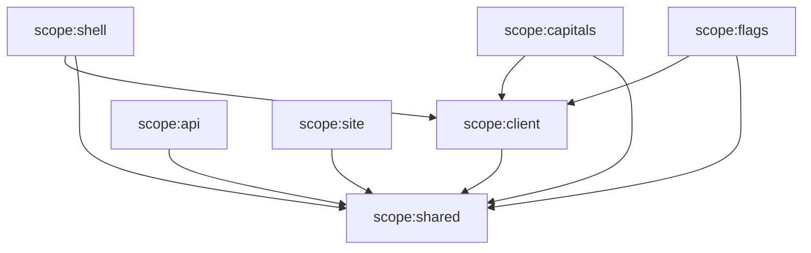
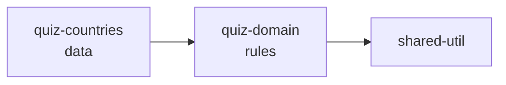

# Nx workspace

Why Nx: [ADR-001](../decisions/ADR-001-nx.md).

## Concepts used in this repository

### Project graph

Nx builds a graph of every project (apps and libs) and the dependencies
between them. It discovers dependencies by reading TypeScript imports and
resolving them through `tsconfig.base.json` `paths`, and npm dependencies from
`package-lock.json`. Every other Nx feature (affected, caching, boundaries)
depends on this graph.

```bash
npx nx graph            # interactive visualisation
npx nx show projects    # list projects
npx nx show project api # resolved targets of one project
```

> The lockfile must be committed and not git-ignored. Nx reads it to know
> external packages; without it, tasks fail with
> `externalDependency 'eslint' could not be found`.

### Targets, executors and inferred tasks

A **target** is a runnable task of a project (`build`, `test`, `lint`,
`typecheck`, `e2e`). Targets come from two places:

- **Explicit** in `project.json`, using an **executor** (e.g.
  `@angular/build:application`, `@nx/esbuild:esbuild`, or `nx:run-commands`
  for plain shell commands such as `tsc --noEmit`).
- **Inferred** by plugins listed in `nx.json#plugins`. `@nx/eslint/plugin` adds
  `lint` to any project with an `eslint.config.mjs`; `@nx/vitest` adds `test`
  wherever a `vitest.config.mts` exists; `@nx/cypress/plugin` adds `e2e` and
  `e2e-ci`.

`npx nx show project <name>` prints the final merged result.

### Caching

Cacheable targets (`targetDefaults` in `nx.json`) are hashed from their
**inputs**: source files, dependency sources, relevant config, and external
package versions. If the hash was seen before, Nx replays the output instead of
re-running. `namedInputs.production` excludes spec files, so editing a test does
not invalidate a production build. `tsconfig.base.json` is a shared global
input because it affects every project.

### Affected

`nx affected -t <targets>` compares the current commit with a base commit,
maps changed files to projects, and runs targets only for those projects **and
everything that depends on them**. A change in `quiz-domain` re-tests the API
and all frontends; a change in `apps/flags` only touches Flags.

## Workspace layout

```
apps/
  shell/        Angular app (future Ionic host)           scope:shell     type:app
  capitals/     Angular app (future remote)               scope:capitals  type:app
  flags/        Angular app (future remote)               scope:flags     type:app
  api/          Express 5 (esbuild, ESM)                  scope:api       type:app
  site/         Angular SSR public site                   scope:site      type:app
  shell-e2e/    Cypress                                   scope:shell     type:e2e
libs/
  quiz/domain/     Pure TS quiz rules                     scope:shared    type:domain
  quiz/countries/  Static 195-country dataset             scope:shared    type:domain
  shared/design-tokens/ CSS custom properties (Sass)     scope:shared    type:ui
  client/ui/       Design system (Angular)                scope:client    type:ui
  client/i18n/     Transloco + en/ru translations         scope:client    type:data-access
  client/settings/ Settings store, storage, theme sync    scope:client    type:data-access
  client/auth/     Sign-in state, API calls, interceptor  scope:client    type:data-access
  client/progress/ Progress on the device, outbox, sync   scope:client    type:data-access
  shared/util/  Pure TS helpers                           scope:shared    type:util
```

Planned libraries (created in the phase that needs them, never as empty placeholders).
Platform services (haptics, audio, network status) will join `client/settings`
or a `client/platform` library when the features that need them arrive:

| Library                                               | Tags                               | Phase |
| ----------------------------------------------------- | ---------------------------------- | ----- |
| `shared/contracts` – Zod API schemas/types            | `scope:shared`, `type:contracts`   | ✅ 6  |
| `client/quiz-ports` – shell ↔ remote injection tokens | `scope:client`, `type:ports`       | ✅ 4  |
| `client/quiz-feature` – shared quiz play UI           | `scope:client`, `type:feature`     | ✅ 4  |
| `client/auth` – sign-in state, API calls, interceptor | `scope:client`, `type:data-access` | ✅ 7b |
| `client/progress` – local store (Dexie), outbox, sync | `scope:client`, `type:data-access` | ✅ 8b |

## Module boundaries

Every project carries a **scope** tag (who may use it) and a **type** tag
(which architectural layer it is). `@nx/enforce-module-boundaries` in
[`eslint.config.mjs`](../../eslint.config.mjs) allows an import only when
**both** rules pass.

### Scope rules



Remotes can never import the shell, the API can never import client code, and
`scope:shared` can only import `scope:shared`.

### Type (layer) rules

| Source type   | May depend on                                              |
| ------------- | ---------------------------------------------------------- |
| `app`         | feature, ui, data-access, ports, contracts, domain, util   |
| `e2e`         | contracts, util                                            |
| `feature`     | feature, ui, data-access, ports, contracts, domain, util   |
| `ui`          | ui, domain, util (no data-access: UI stays presentational) |
| `data-access` | data-access, ports, contracts, domain, util                |
| `ports`       | contracts, domain, util                                    |
| `contracts`   | contracts, domain, util                                    |
| `domain`      | domain, util                                               |
| `util`        | util                                                       |

### Platform purity of `domain` and `util`

The shared libraries (`quiz-domain`, `quiz-countries`, `shared-util`) must run
unchanged in a browser, a WebView and Node.js.
Four independent guards enforce this (each was verified by adding a violating
file and watching lint/typecheck fail):

1. `tsconfig.lib.json` uses `lib: ["es2022"]` and `types: []`, so `window`,
   `document`, `process` and `Buffer` do not exist for the compiler.
2. `bannedExternalImports` (applied to projects tagged **both** `scope:shared`
   and `type:domain`/`type:util`/`type:contracts`, via `allSourceTags`) blocks `@angular/*`, `@ionic/*`, `@capacitor/*`,
   `rxjs`, `express`, `zod`, `dexie`, `drizzle-orm`.
3. `no-restricted-imports` blocks `node:*` and bare Node built-ins (`fs`,
   `path`, …), which are not npm packages and so are invisible to rule 2.
   Bare names are listed as exact `paths`, not `patterns`: patterns use
   gitignore semantics, so `util` would also match `@world-quiz/shared/util`
   (a bug found in Phase 2 when the domain first imported that library).
4. `no-restricted-globals` blocks browser and Node globals, as a second line of defence.

## TypeScript configuration

- `tsconfig.base.json` holds shared strict settings (`strict`,
  `noUncheckedIndexedAccess`, `noPropertyAccessFromIndexSignature`, …) and the
  `paths` aliases. It deliberately has **no `baseUrl`**: TypeScript 6
  deprecates it and `paths` resolve relative to the config file.
- Each project has `tsconfig.json` (references only), plus
  `tsconfig.app.json`/`tsconfig.lib.json` for production code and
  `tsconfig.spec.json` for tests with test-only types.
- Angular apps enable `strictTemplates`. Their `typecheck` target uses
  `ngc --noEmit`, which type-checks templates too; plain `tsc` would not.

## Tests for Angular libraries

Angular's official unit-test builder (`@angular/build:unit-test`, Vitest) needs
an application build to compile specs. Non-buildable Angular libraries
therefore use the shell's development build as their test build:

```json
"test": {
  "executor": "@angular/build:unit-test",
  "options": {
    "buildTarget": "shell:build:development",
    "tsConfig": "libs/client/ui/tsconfig.spec.json",
    "watch": false
  }
}
```

The builder only runs the spec files of the library's own tsconfig, so each
library still has its own `nx test <lib>` target. The alternative Nx offers
(AnalogJS's Vite plugin, `vitest-analog`) could not be installed: its optional
peer dependency on `@angular-devkit/build-angular` makes npm's resolver fail
with Angular 22. See docs/development/troubleshooting.md.

## Adding a new library

```bash
npx nx g @nx/js:library libs/<area>/<name> \
  --name=<area>-<name> \
  --importPath=@world-quiz/<area>/<name> \
  --tags="scope:<scope>,type:<type>"
```

Then add a `typecheck` target (copy from `libs/shared/util/project.json`) and,
for platform-independent code, apply `pureLibraryConfig` in its ESLint config.

## Dependency direction between the quiz libraries



`quiz-domain` never imports the dataset: the engine receives it as a
parameter (`createQuizEngine(COUNTRIES)`). This keeps the dependency acyclic,
lets domain tests use a small fixture dataset, and lets the real 195-country
dataset be tested in `quiz-countries`, including a full challenge replay.
