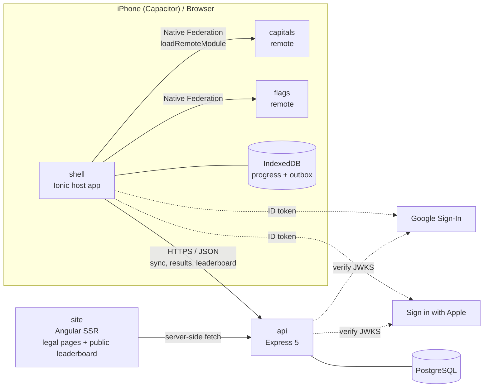

# Architecture overview

> Status legend: ✅ implemented · 🧱 foundation/skeleton only · 📐 designed, not implemented yet

## System context

## Building blocks

| Unit                                               | Responsibility                                                                                                                          | Status                                                                                                                                                                 |
| -------------------------------------------------- | --------------------------------------------------------------------------------------------------------------------------------------- | ---------------------------------------------------------------------------------------------------------------------------------------------------------------------- |
| `apps/shell`                                       | Bootstrap, auth, tabs, Home, Quiz Setup, Leaderboard, Achievements, Settings; Native Federation host                                    | ✅ welcome + required sign-in, tabs, Home, quiz setup, Leaderboard (challenges, rankings, records), Achievements, Settings (nickname), federation host                 |
| `apps/capitals`                                    | Capitals play + results route; Native Federation remote                                                                                 | ✅ ([microfrontends.md](microfrontends.md))                                                                                                                            |
| `apps/flags`                                       | Flags play + results route; Native Federation remote                                                                                    | ✅ ([microfrontends.md](microfrontends.md))                                                                                                                            |
| `apps/api`                                         | REST API: auth, sessions (idempotent result ingestion), progress sync, leaderboard                                                      | ✅ sign-in (Google, Apple), sessions per player, server-graded and idempotent, history for sync, leaderboard challenges, boards and records ([backend.md](backend.md)) |
| `apps/site`                                        | Angular SSR: prerendered legal pages, server-rendered public leaderboard                                                                | ✅ en/ru, home, Privacy, Terms, leaderboards ([site.md](site.md))                                                                                                      |
| `apps/shell-e2e`                                   | Cypress user journeys                                                                                                                   | ✅ navigation, theme, language, Capitals quiz across the federation boundary · 📐 the remaining journeys                                                               |
| `libs/quiz/domain`                                 | Pure TS quiz rules shared by client and server: engine, answer matching, scoring, mastery, progress, achievements, leaderboard          | ✅                                                                                                                                                                     |
| `libs/quiz/countries`                              | 195-country dataset (en/ru), UN M49 regions, flag asset paths                                                                           | ✅                                                                                                                                                                     |
| `libs/shared/util`                                 | Dependency-free helpers (`Clock`, `Result`, `assertNever`)                                                                              | ✅                                                                                                                                                                     |
| `libs/client/ui`, `client/i18n`, `client/settings` | Design system, English/Russian i18n, settings store and theme/language sync                                                             | ✅                                                                                                                                                                     |
| `libs/client/quiz-ports`                           | The shell ↔ remote contract: `QUIZ_RESULT_SINK`, `QUIZ_PROGRESS_READER`, `COUNTRY_DATASET`, `CLOCK`                                     | ✅                                                                                                                                                                     |
| `libs/client/quiz-feature`                         | The quiz screens themselves (play, results), used by every remote                                                                       | ✅                                                                                                                                                                     |
| `libs/client/auth`, `libs/client/progress`         | Sign-in state and API calls; progress on the device (IndexedDB), outbox and sync ([ADR-006](../decisions/ADR-006-local-persistence.md)) | ✅                                                                                                                                                                     |
| `libs/shared/contracts`                            | Zod schemas of API requests, responses and errors, shared by server and client                                                          | ✅                                                                                                                                                                     |

## Key architectural principles

1. **One domain, many runtimes.** Quiz rules live once in `quiz-domain` and run
   in the browser (offline play) and on the server (result validation).
2. **The server is authoritative; the client is optimistic.** The client never
   sends rank, score, mastery or user ID as facts. It sends answers; the server recomputes.
3. **Offline-first core.** Dataset, flags, quiz play, progress and mistakes work
   without a network. Auth, sync and leaderboards are online features.
4. **Minimal microfrontend coupling.** Shell ↔ remotes communicate via routes,
   query-param contracts and injected ports, never shared mutable global state
   ([microfrontends.md](microfrontends.md)).
5. **Boundaries are enforced by tooling**, not by convention (tags, tsconfig, ESLint).

## Approved product rules (Phase 0)

These rules were approved before implementation and constrain every later phase.

### Country scope

193 UN member states + 2 UN observer states (Vatican City, Palestine) = **195
countries**. Kosovo, Taiwan and Western Sahara are excluded and documented as
known ambiguities. For countries with more than one capital, the primary or
official seat is the main answer; other legitimate capitals are accepted in
Hard mode. Details: [countries.md](../domain/countries.md).

### Training vs competition

| Concept                                                            | Modes                                                | Ranked globally?                   |
| ------------------------------------------------------------------ | ---------------------------------------------------- | ---------------------------------- |
| **Training** (optimised for learning)                              | Fixed, Endless, Timed, Practice Mistakes; any region | Never                              |
| **Leaderboard challenge** (optimised for perfect accuracy + speed) | Complete World set, Easy or Hard                     | Yes: 4 boards, fastest perfect run |

Details: [quiz engine](../domain/quiz-engine.md) · [answer matching](../domain/answer-matching.md) · [scoring](../domain/scoring.md) · [mastery](../domain/mastery.md) · [achievements](../domain/achievements.md) · [leaderboard](../domain/leaderboard.md).

### Hard-mode input

Hard mode takes free text from the **native keyboard**, including **iOS keyboard
dictation**. Typed and dictated text follow the same path: a deterministic, local
normalization and conservative fuzzy-matching pipeline (case, whitespace,
Unicode normalization, punctuation, English/Russian names, aliases, reasonable
typos). The app has no custom speech-recognition UI and no external AI/LLM judging.

## Delivery phases

| #   | Branch                       | Scope                                                                                  | Status         |
| --- | ---------------------------- | -------------------------------------------------------------------------------------- | -------------- |
| 1   | `feat/project-foundation`    | Nx, apps/libs skeleton, boundaries, CI, ADR-001/002/007                                | ✅ merged      |
| 2   | `feat/domain-model`          | 195-country dataset + flags, engine, matching, scoring, mastery, achievements, ranking | ✅ merged      |
| 3   | `feat/shell-design-system`   | Ionic shell, tokens, Liquid Glass, themes, i18n, Settings                              | ✅ merged      |
| 4   | `feat/capitals-mfe`          | Native Federation host/remote, setup, play, results                                    | ✅ merged      |
| 5   | `feat/flags-mfe`             | Flags remote                                                                           | ✅ merged      |
| 6   | `feat/backend-database`      | Express, Drizzle, migrations, API tests                                                | ✅ merged      |
| 7a  | `feat/auth-server`           | Sign-in (Apple, Google ID tokens), tokens, account deletion — API                      | ✅ merged      |
| 7b  | `feat/auth-client`           | Sign-in, sign-out and account deletion in the app                                      | ✅ merged      |
| 8a  | `feat/sync-server`           | A player's history for sync (`GET /v1/sessions`, keyset pages) — API                   | ✅ merged      |
| 8b  | `feat/sync-client`           | Sign-in first, local store (IndexedDB), outbox, sync                                   | ✅ merged      |
| 9a  | `feat/leaderboard-server`    | Challenges with a server seed, ranked runs, public boards, records, nicknames — API    | ✅ merged      |
| 9b  | `feat/leaderboard-client`    | Challenges and the leaderboard screen in the app                                       | ✅ merged      |
| 9c  | `feat/site-ssr`              | `apps/site` SSR: legal pages, public leaderboard; SSR-in-shell spike, ADR-003          | ✅ merged      |
| 10  | `feat/achievements-mistakes` | Achievements, practice mistakes                                                        | ✅ this branch |
| 11  | `feat/e2e`                   | Full Cypress journeys                                                                  | 📐             |
| 12  | `feat/ci-cd`                 | Deployment pipelines                                                                   | 📐             |
| 13  | `feat/ios`                   | Capacitor iOS, TestFlight docs                                                         | 📐             |
| 14  | `feat/polish`                | a11y, performance, animation, audio/haptics, security review                           | 📐             |
