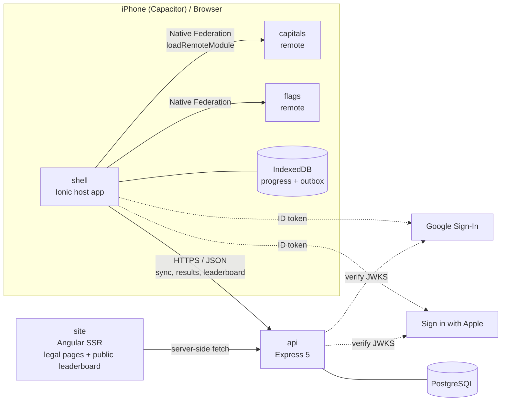

# Architecture overview

> Status legend: ✅ implemented · 🧱 foundation/skeleton only · 📐 designed, not implemented yet

## System context

## Building blocks

| Unit                          | Responsibility                                                                                       | Status                  |
| ----------------------------- | ---------------------------------------------------------------------------------------------------- | ----------------------- |
| `apps/shell`                  | Bootstrap, auth, tabs, Home, Quiz Setup, Leaderboard, Achievements, Settings; Native Federation host | 🧱                      |
| `apps/capitals`, `apps/flags` | Category-specific play + results routes; Native Federation remotes                                   | 🧱                      |
| `apps/api`                    | REST API: auth, sessions (idempotent result ingestion), progress sync, leaderboard                   | 🧱 (`/health` only)     |
| `apps/site`                   | Angular SSR: prerendered legal pages, server-rendered public leaderboard                             | 📐                      |
| `apps/shell-e2e`              | Cypress user journeys                                                                                | 🧱 (smoke test)         |
| `libs/quiz/domain`            | Pure TS quiz rules shared by client and server                                                       | 🧱 (vocabulary)         |
| `libs/shared/util`            | Dependency-free helpers (`Clock`, `assertNever`)                                                     | ✅                      |
| Other libs                    | `quiz/countries`, `shared/contracts`, `client/*`                                                     | 📐 (see [nx.md](nx.md)) |

## Key architectural principles

1. **One domain, many runtimes.** Quiz rules live once in `quiz-domain` and run
   in the browser (offline play) and on the server (result validation).
2. **The server is authoritative; the client is optimistic.** The client never
   sends rank, score, mastery or user ID as facts. It sends answers; the server recomputes.
3. **Offline-first core.** Dataset, flags, quiz play, progress and mistakes work
   without a network. Auth, sync and leaderboards are online features.
4. **Minimal microfrontend coupling.** Shell ↔ remotes communicate via routes,
   query-param contracts and injected ports, never shared mutable global state.
5. **Boundaries are enforced by tooling**, not by convention (tags, tsconfig, ESLint).

## Approved product rules (Phase 0)

These rules were approved before implementation and constrain every later phase.

### Country scope

193 UN member states + 2 UN observer states (Vatican City, Palestine) = **195
countries**. Kosovo, Taiwan and Western Sahara are excluded and documented as
known ambiguities. For countries with more than one capital, the primary or
official seat is the main answer; other legitimate capitals are accepted in
Hard mode. Full dataset documentation arrives in Phase 2 (`docs/domain/countries.md`).

### Training vs competition

| Concept                                                            | Modes                                                | Ranked globally?                   |
| ------------------------------------------------------------------ | ---------------------------------------------------- | ---------------------------------- |
| **Training** (optimised for learning)                              | Fixed, Endless, Timed, Practice Mistakes; any region | Never                              |
| **Leaderboard challenge** (optimised for perfect accuracy + speed) | Complete World set, Easy or Hard                     | Yes: 4 boards, fastest perfect run |

Details: [leaderboard rules](../domain/leaderboard.md) · [mastery rules](../domain/mastery.md).

### Hard-mode input

Hard mode takes free text from the **native keyboard**, including **iOS keyboard
dictation**. Typed and dictated text follow the same path: a deterministic, local
normalization and conservative fuzzy-matching pipeline (case, whitespace,
Unicode normalization, punctuation, English/Russian names, aliases, reasonable
typos). The app has no custom speech-recognition UI and no external AI/LLM judging.

## Delivery phases

| #   | Branch                       | Scope                                                                                  | Status         |
| --- | ---------------------------- | -------------------------------------------------------------------------------------- | -------------- |
| 1   | `feat/project-foundation`    | Nx, apps/libs skeleton, boundaries, CI, ADR-001/002/007                                | ✅ this branch |
| 2   | `feat/domain-model`          | 195-country dataset + flags, engine, matching, scoring, mastery, achievements, ranking | 📐             |
| 3   | `feat/shell-design-system`   | Ionic shell, tokens, Liquid Glass, themes, i18n, Settings                              | 📐             |
| 4   | `feat/capitals-mfe`          | Native Federation host/remote, setup, play, results                                    | 📐             |
| 5   | `feat/flags-mfe`             | Flags remote                                                                           | 📐             |
| 6   | `feat/backend-database`      | Express, Drizzle, migrations, API tests                                                | 📐             |
| 7   | `feat/authentication`        | Apple, Google, sessions, account deletion                                              | 📐             |
| 8   | `feat/offline-sync`          | Local store, outbox, sync                                                              | 📐             |
| 9   | `feat/leaderboard-records`   | Perfect-run challenges, records, `apps/site` SSR                                       | 📐             |
| 10  | `feat/achievements-mistakes` | Achievements, practice mistakes                                                        | 📐             |
| 11  | `feat/e2e`                   | Full Cypress journeys                                                                  | 📐             |
| 12  | `feat/ci-cd`                 | Deployment pipelines                                                                   | 📐             |
| 13  | `feat/ios`                   | Capacitor iOS, TestFlight docs                                                         | 📐             |
| 14  | `feat/polish`                | a11y, performance, animation, audio/haptics, security review                           | 📐             |
