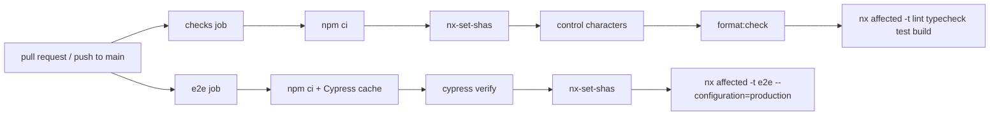

# CI/CD

## Continuous integration

Workflow: [`.github/workflows/ci.yml`](../../.github/workflows/ci.yml).
Runs on every pull request and on pushes to `main`.



| Job      | What fails it                                                                                                                                                                                                               |
| -------- | --------------------------------------------------------------------------------------------------------------------------------------------------------------------------------------------------------------------------- |
| `checks` | Raw control characters in tracked text files, unformatted files, lint errors (including module-boundary violations), type errors (including Angular templates), failing unit/component/API tests, failing production builds |
| `e2e`    | Failing Cypress specs against production-configuration builds of **both** the shell and the Capitals remote. Screenshots are uploaded as an artifact on failure.                                                            |

Every step exits non-zero on failure. No step uses `continue-on-error`.

### How `affected` works in CI

`nrwl/nx-set-shas` sets `NX_BASE` and `NX_HEAD`:

- **Pull request:** base = merge base with the target branch.
- **Push to `main`:** base = last commit on `main` with a successful CI run.

`nx affected` then runs targets only for projects touched by the diff and
their dependents. A change to `tsconfig.base.json` or `package-lock.json`
affects every project.

### Design choices

- **No Nx Cloud.** Remote caching and task distribution would speed CI up, but
  add an external service and account. `NX_NO_CLOUD=true` makes the choice explicit.
  Consequence: the atomized `e2e-ci` target (one task per spec) is unavailable
  because Nx requires Nx Cloud for it, so CI runs the regular `e2e` target.
- **Two parallel jobs.** E2E is the slowest step and needs the Cypress binary,
  so it runs separately. The `checks` job skips the binary download (`CYPRESS_INSTALL_BINARY=0`).
- **E2E starts five servers.** The Cypress web-server command is
  `nx run-many -t serve-static serve-e2e serve-ssr -p shell capitals flags api site`: a quiz
  is only really federated if its remote is fetched from its own origin
  (`http://localhost:4201`, `:4202`), and sign-in needs the API (`:3333`,
  `api:serve-e2e`: a fresh PGlite database in `tmp/e2e-api` and the dev
  sign-in); the public site runs from its production build on `:4300`
  (`site:serve-ssr`). `shell-e2e` declares them as implicit dependencies, so
  `nx affected` also runs E2E when only one of them changes.
- **Node version from `.nvmrc`**, so local and CI use the same major.
- **`concurrency` with `cancel-in-progress`**: a new push cancels the outdated run for the same branch.
- **Least privilege:** `contents: read`, plus `actions: read` for `nx-set-shas`.

### Recommended repository settings (manual, GitHub UI)

Settings → Branches → add a protection rule (or ruleset) for `main`:

- Require a pull request before merging.
- Require status checks: `Format · Lint · Typecheck · Unit tests · Build` and `Cypress E2E`.
- Require branches to be up to date before merging.
- Block force pushes.

### Reproduce CI locally

```bash
npm ci
npm run check:control-chars
npx nx format:check
npx nx run-many -t lint typecheck test build
npx nx run-many -t e2e --configuration=production
```

## Continuous delivery

Not implemented yet. The plan (Phase 12, iOS in Phase 13):

| Target                       | Plan                                                                                                                                                                      |
| ---------------------------- | ------------------------------------------------------------------------------------------------------------------------------------------------------------------------- |
| Web (shell + remotes + site) | Static hosting per app with an environment-specific federation manifest; `site` needs a Node host for SSR                                                                 |
| API + PostgreSQL             | Managed Node host + managed PostgreSQL; migrations as a release step                                                                                                      |
| iOS                          | Capacitor build, signing and TestFlight upload through a manually approved workflow; credentials as GitHub secrets (placeholders until an Apple Developer account exists) |
