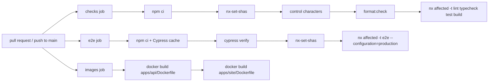
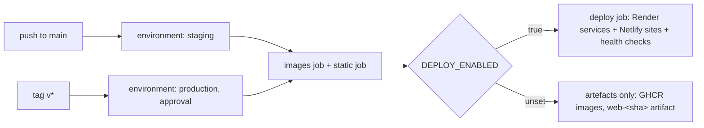

# CI/CD

## Continuous integration

Workflow: [`.github/workflows/ci.yml`](../../.github/workflows/ci.yml).
Runs on every pull request and on pushes to `main`.



| Job      | What fails it                                                                                                                                                                                                               |
| -------- | --------------------------------------------------------------------------------------------------------------------------------------------------------------------------------------------------------------------------- |
| `checks` | Raw control characters in tracked text files, unformatted files, lint errors (including module-boundary violations), type errors (including Angular templates), failing unit/component/API tests, failing production builds |
| `e2e`    | Failing Cypress specs against production-configuration builds of the shell, both remotes, the API (`serve-e2e`) and the site (`serve-ssr`). Screenshots are uploaded as an artifact on failure.                             |
| `images` | A container image that no longer builds. The images are built from the repository root (`apps/api/Dockerfile`, `apps/site/Dockerfile`) and **not** pushed here; `release.yml` publishes them.                               |

Every step exits non-zero on failure. No step uses `continue-on-error`.

### How `affected` works in CI

`nrwl/nx-set-shas` sets `NX_BASE` and `NX_HEAD`:

- **Pull request:** base = merge base with the target branch.
- **Push to `main`:** base = last commit on `main` with a successful CI run.

`nx affected` then runs targets only for projects touched by the diff and
their dependents. A change to `tsconfig.base.json` or `package-lock.json`
affects every project.

### Design choices

- **No Nx Cloud.** Remote caching and task distribution would speed CI up, but
  add an external service and account. `NX_NO_CLOUD=true` makes the choice explicit.
  Consequence: the atomized `e2e-ci` target (one task per spec) is unavailable
  because Nx requires Nx Cloud for it, so CI runs the regular `e2e` target.
- **Two parallel jobs.** E2E is the slowest step and needs the Cypress binary,
  so it runs separately. The `checks` job skips the binary download (`CYPRESS_INSTALL_BINARY=0`).
- **E2E starts five servers.** The Cypress web-server command is
  `nx run-many -t serve-static serve-e2e serve-ssr -p shell capitals flags api site`: a quiz
  is only really federated if its remote is fetched from its own origin
  (`http://localhost:4201`, `:4202`), and sign-in needs the API (`:3333`,
  `api:serve-e2e`: a fresh PGlite database in `tmp/e2e-api` and the dev
  sign-in); the public site runs from its production build on `:4300`
  (`site:serve-ssr`). `shell-e2e` declares them as implicit dependencies, so
  `nx affected` also runs E2E when only one of them changes.
- **Node version from `.nvmrc`**, so local and CI use the same major.
- **`concurrency` with `cancel-in-progress`**: a new push cancels the outdated run for the same branch.
- **Least privilege:** `contents: read`, plus `actions: read` for `nx-set-shas`.

### Recommended repository settings (manual, GitHub UI)

Settings → Branches → add a protection rule (or ruleset) for `main`:

- Require a pull request before merging.
- Require status checks: `Format · Lint · Typecheck · Unit tests · Build` and `Cypress E2E`.
- Require branches to be up to date before merging.
- Block force pushes.

### Reproduce CI locally

```bash
npm ci
npm run check:control-chars
npx nx format:check
npx nx run-many -t lint typecheck test build
npx nx run-many -t e2e --configuration=production
```

## Continuous delivery

Workflow: [`.github/workflows/release.yml`](../../.github/workflows/release.yml).
Full instructions: [deploying.md](deploying.md); the configuration rules are
[ADR-012](../decisions/ADR-012-environments.md).



| Job      | What it produces                                                                                                                                                                                                                |
| -------- | ------------------------------------------------------------------------------------------------------------------------------------------------------------------------------------------------------------------------------- |
| `images` | `ghcr.io/<owner>/world-quiz-api` (one image for every environment) and `world-quiz-site` (built per environment, because its pages are prerendered)                                                                             |
| `static` | Production builds of `shell`, `capitals` and `flags` plus the environment's `config.json` and `federation.manifest.json`, as artifact `web-<sha>`                                                                               |
| `deploy` | Only with `DEPLOY_ENABLED=true`: Render's API is asked to deploy the exact image tag for the API and the site, `netlify deploy --prod` publishes the three bundles, then health checks on `/health`, the site and `config.json` |

**Nothing is hosted yet**, so `DEPLOY_ENABLED` is unset and the `deploy` job
is skipped: the pipeline is complete and provably builds what would be
deployed, without pretending a service is running. The API's migrations run
at its start-up, so deploying its image is the whole database step (ADR-005).

iOS (Phase 13) is not part of this workflow: Capacitor bundles the remotes
into the app, and signing and TestFlight need an Apple Developer account.
