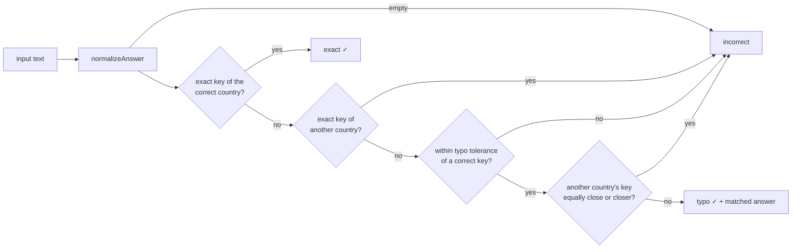

# Hard-mode answer matching

> Status: **implemented** (Phase 2). Code:
> [`answer-matching.ts`](../../libs/quiz/domain/src/lib/answer-matching.ts),
> tests: [`answer-matching.spec.ts`](../../libs/quiz/domain/src/lib/answer-matching.spec.ts)
> and the real-dataset cases in
> [`countries.data.spec.ts`](../../libs/quiz/countries/src/lib/countries.data.spec.ts).

## Goals

- Accept what a reasonable person typed **or dictated** with the iOS keyboard.
- **Never** accept an answer that is actually another country's answer.
- Deterministic and local: same input, same verdict, on the phone, offline and
  on the server. No network, no AI.

Typed and dictated input are indistinguishable once iOS has produced text, so
there is a single pipeline.

## Pipeline



### 1. Normalization (`normalizeAnswer`)

| Step                                                                                       | Example                                                          |
| ------------------------------------------------------------------------------------------ | ---------------------------------------------------------------- |
| Unicode NFC, lowercase                                                                     | `PARIS` → `paris`                                                |
| `ё` → `е`                                                                                  | `Кишинёв` → `кишинев`                                            |
| Remove Latin diacritics (NFD + strip combining marks), keep `й`                            | `São Tomé` → `sao tome`, `Ниамей` stays                          |
| Remove apostrophes and dots without splitting                                              | `N'Djamena` → `ndjamena`, `D.C.` → `dc`                          |
| Any other non-letter/digit splits words (spaces, tabs, NBSP, hyphens, dashes, commas, `&`) | `Port-au-Prince` → `port au prince`                              |
| `st` → `saint`                                                                             | `St. John's` → `saint johns`                                     |
| Drop `the`, `and`, `of`, `и`                                                               | `The Gambia` → `gambia`, `Антигуа и Барбуда` → `антигуа барбуда` |
| Join words without spaces                                                                  | `port au prince` → `portauprince`                                |

Joining without spaces makes "Portauprince", "Port au Prince" and
"Port-au-Prince" identical. `й` is kept because in Russian it is a different
letter, not `и` with a diacritic.

### 2. Accepted answers

For each country the index holds the display values and aliases **in all
supported languages**. A Russian-UI player who types "Moscow" is right. This
also helps dictation, which sometimes produces the English form.

### 3. Typo tolerance

Distance is the **optimal string alignment** distance: Levenshtein
(insert/delete/substitute) plus swapping two adjacent letters, each costing 1
edit. The tolerance depends on the length of the accepted answer's key:

| Key length | Edits allowed | Examples accepted                              |
| ---------- | ------------- | ---------------------------------------------- |
| ≤ 3        | 0             | "Рим", "Чад", "США" must be exact              |
| 4–7        | 1             | "Pariss", "Parsi", "Viena", "Моска"            |
| 8–12       | 2             | "Basetere" → Basseterre                        |
| ≥ 13       | 3             | long names such as "Sri Jayawardenepura Kotte" |

The computation stops as soon as the bound is exceeded, so checking an input
against ~1,000 accepted answers is cheap.

### 4. Ambiguity guard

A typo is accepted only if **no other country's answer is equally close or
closer**. This is the rule that keeps the tolerance safe:

| Asked       | Input       | Result | Why                                      |
| ----------- | ----------- | ------ | ---------------------------------------- |
| Iran        | Iraq        | ✗      | Exactly another country                  |
| Gambia      | Zambia      | ✗      | Exactly another country                  |
| Niger       | Nigera      | ✗      | 1 edit from Niger **and** 1 from Nigeria |
| Iran        | Iram        | ✗      | 1 edit from Iran **and** 1 from Iraq     |
| Gambia      | Gambai      | ✓ typo | 1 edit from Gambia, 2 from Zambia        |
| Philippines | Phillipines | ✓ typo | no other country that close              |

## Result

```ts
type Exact = { kind: 'exact'; matchedText: string };
type Typo = { kind: 'typo'; matchedText: string; distance: number };
type Incorrect = { kind: 'incorrect'; matchedCountryCode?: string };

type AnswerMatch = Exact | Typo | Incorrect;
```

`matchedText` lets the UI say _"Accepted: Paris"_ after a typo.
`matchedCountryCode` lets it say _"That's the capital of Germany"_.

## Trade-offs

- **False accepts vs false rejects.** Tolerances are conservative; a player may
  occasionally see a near-miss rejected. That is preferred to accepting a wrong
  country, especially for the perfect-run leaderboard.
- **Transliterations** such as "Moskva" are not accepted unless listed as aliases.
  Adding every transliteration would weaken the ambiguity guard.
- **Aliases are curated data**, not algorithmic, so they can be reviewed.
- **No phonetic matching** (Soundex, Metaphone): these algorithms are
  English-centric and would behave unpredictably for Russian and for foreign names.
- **Cross-language acceptance** is generous by design; it cannot cause a false
  accept because the ambiguity guard sees all languages.

## Test coverage

Tests cover valid answers, localized answers, case, whitespace (including tabs
and NBSP), punctuation, diacritics in NFC and NFD, known aliases, keyboard
errors (neighbouring keys, missing/extra/doubled letters, swaps), clearly
incorrect answers, look-alike countries, short answers, and blank input. On the
real dataset, every display value is checked to be correct only for its own
country (195 × 195 pairs, both categories, both languages).
