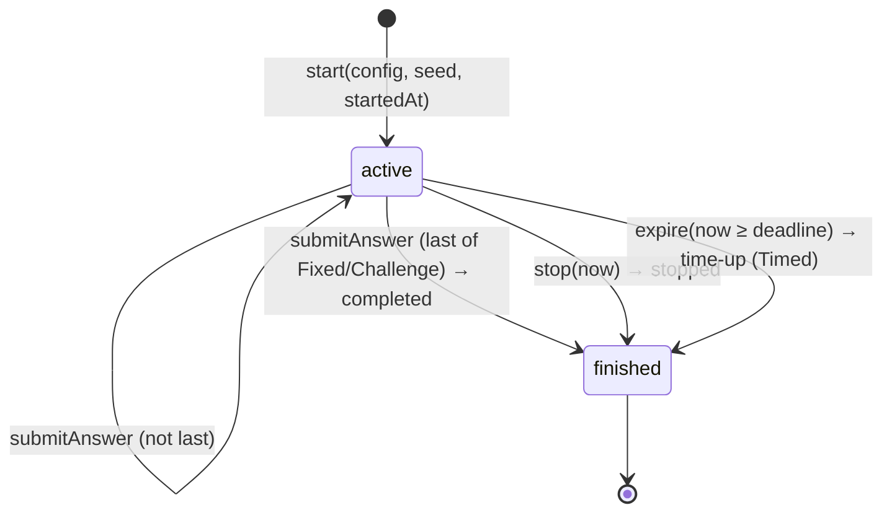

# Quiz engine

> Status: **implemented** (Phase 2). Code:
> [`session.ts`](../../libs/quiz/domain/src/lib/session.ts),
> [`questions.ts`](../../libs/quiz/domain/src/lib/questions.ts),
> [`random.ts`](../../libs/quiz/domain/src/lib/random.ts).

The engine is plain TypeScript with no Angular, browser or Node dependency
(see [nx.md](../architecture/nx.md#platform-purity-of-domain-and-util)). The
Capitals and Flags microfrontends use it for play; the API will use the same
code to re-validate submitted sessions.

## Concepts

| Concept           | Meaning                                                                                                                      |
| ----------------- | ---------------------------------------------------------------------------------------------------------------------------- |
| `QuizConfig`      | What to play: category, difficulty, mode, scope, optional question count (Fixed) and country restriction (Practice Mistakes) |
| `QuizSession`     | Immutable state: config, **seed**, start time, recorded answers, status, end reason                                          |
| `QuestionSource`  | Generates question _n_ of a session from its seed; questions are never stored                                                |
| `SubmittedAnswer` | `{ kind: 'choice', countryCode }` (Easy) or `{ kind: 'text', text }` (Hard)                                                  |
| `AnswerRecord`    | What was asked, what was answered, whether it was correct and how it was judged                                              |
| `SessionRecord`   | What a client uploads: config, seed, start/finish, end reason, raw answers with timestamps                                   |

## Modes

| Mode              | Length                                                                                | Ends when                                       | Ranked                                    |
| ----------------- | ------------------------------------------------------------------------------------- | ----------------------------------------------- | ----------------------------------------- |
| **Fixed**         | `questionCount` (default 10), capped at the pool size, no repeats                     | last answer (`completed`) or `stop` (`stopped`) | no                                        |
| **Endless**       | unlimited; the pool is reshuffled each cycle and never repeats a country back-to-back | `stop` (`stopped`)                              | no                                        |
| **Timed**         | unlimited, like Endless                                                               | 60 s after start (`time-up`) or `stop`          | no                                        |
| **Challenge**     | every country of the World scope exactly once                                         | last answer (`completed`) or `stop` (abandoned) | yes, see [leaderboard.md](leaderboard.md) |
| Practice Mistakes | any training mode with `countryCodes` = the player's mistakes                         | as above                                        | no                                        |

Invalid configurations are rejected with a typed error (for example
`challenge-requires-world-scope`, `question-count-requires-fixed-mode`,
`empty-pool`, `unknown-country`).

## Lifecycle

Every operation returns a **new** session object; the old one is unchanged.
This makes state easy to store (signals, IndexedDB), compare and test.

`submitAnswer` returns `{ ok: true, session, record }` or
`{ ok: false, error, session }`:

| Error                    | Meaning                                                             |
| ------------------------ | ------------------------------------------------------------------- |
| `session-finished`       | Answer after the end                                                |
| `time-up`                | Timed session past its deadline. The returned session is finalized. |
| `answer-kind-mismatch`   | Text in Easy mode or a choice in Hard mode                          |
| `invalid-choice`         | A choice that was not offered for this question                     |
| `empty-answer`           | Blank text (the UI shows a validation message; nothing is recorded) |
| `timestamp-out-of-order` | Earlier than the start or than the previous answer                  |

## Determinism (seeds)

Question order and Easy choices come from a seeded pseudo-random generator
(cyrb128 hash → sfc32). Each purpose gets a derived seed
(`seed|order|<cycle>`, `seed|choices|<index>`), so question 7's choices do not
depend on how many random numbers question 6 used.

Why it matters:

1. **Tests** are reproducible without mocking `Math.random`.
2. **Server validation:** the client uploads the seed and raw answers, not
   questions or scores. `engine.replay(record)` regenerates the questions,
   re-grades every answer and re-applies the ending. A mismatch (a choice that
   was never offered, an answer after the timer, a "completed" session with
   missing answers) is rejected.
3. **Comparable challenge runs:** runs with the same seed get the same questions
   and choices. How the server issues seeds is designed in Phase 9.

The generator is not cryptographically secure. Seeds are not secrets; see
the trust model in [leaderboard.md](leaderboard.md).

## Easy-mode choices

Four options: the correct country plus three distractors picked in tiers, each
tier shuffled:

1. same UN sub-region (e.g. France → Germany, Belgium, Switzerland);
2. same region;
3. anywhere else.

Distractors always come from the full dataset, even in a region quiz or in
Practice Mistakes. The option order is shuffled, so the correct answer's
position varies. Options are **country codes**; the UI renders each option's
capital or name in the current language, so switching language mid-quiz is safe.

## Timer robustness (Timed mode)

- The deadline is `startedAt + 60 000 ms`. It is derived, not counted by ticks.
- `remainingTimeMs(session, now)` computes the remaining time from the clock.
  The UI interval only triggers re-rendering.
- `expire(session, now)` finalizes with `finishedAt = deadline`, even if the app
  was in the background and resumes minutes later. Answers at or after the
  deadline are rejected.
- **Clock requirement:** clients should pass a monotonic time
  (`performance.timeOrigin + performance.now()`) so a device clock change cannot
  move time backwards; the engine rejects out-of-order timestamps.
- The server replays with the client's timestamps and applies plausibility
  checks (Phase 9). It cannot see real time on an offline device; this is a
  documented limitation.

## What the engine does not do

- Persist anything, call HTTP, play sounds or show UI. Those are adapters
  around the engine (Phase 3+).
- Decide user identity or ranks; the server owns those.

## Related

- [Answer matching](answer-matching.md) · [Scoring](scoring.md) ·
  [Mastery](mastery.md) · [Achievements](achievements.md) · [Leaderboard](leaderboard.md)
